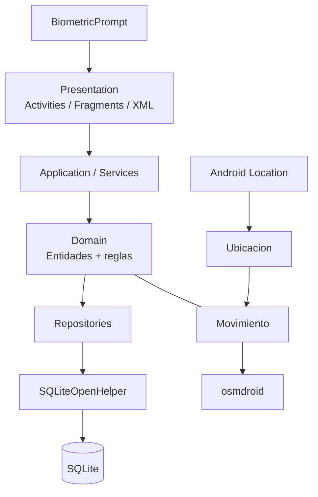

# Diagrama de arquitectura

```mermaid
flowchart TD
    UI[Presentation\nActivities / Fragments / XML] --> APP[Application / Services]
    APP --> DOM[Domain\nEntidades + reglas]
    DOM --> REP[Repositories]
    REP --> DBH[SQLiteOpenHelper]
    DBH --> DB[(SQLite)]

    BIO[BiometricPrompt] --> UI
    LOC[Android Location] --> UB[Ubicacion]
    UB --> MOV[Movimiento]
    MOV --> MAP[osmdroid]
    DOM --- MOV
```

Ver `../../ARCHITECTURE.md` para reglas de dependencia.