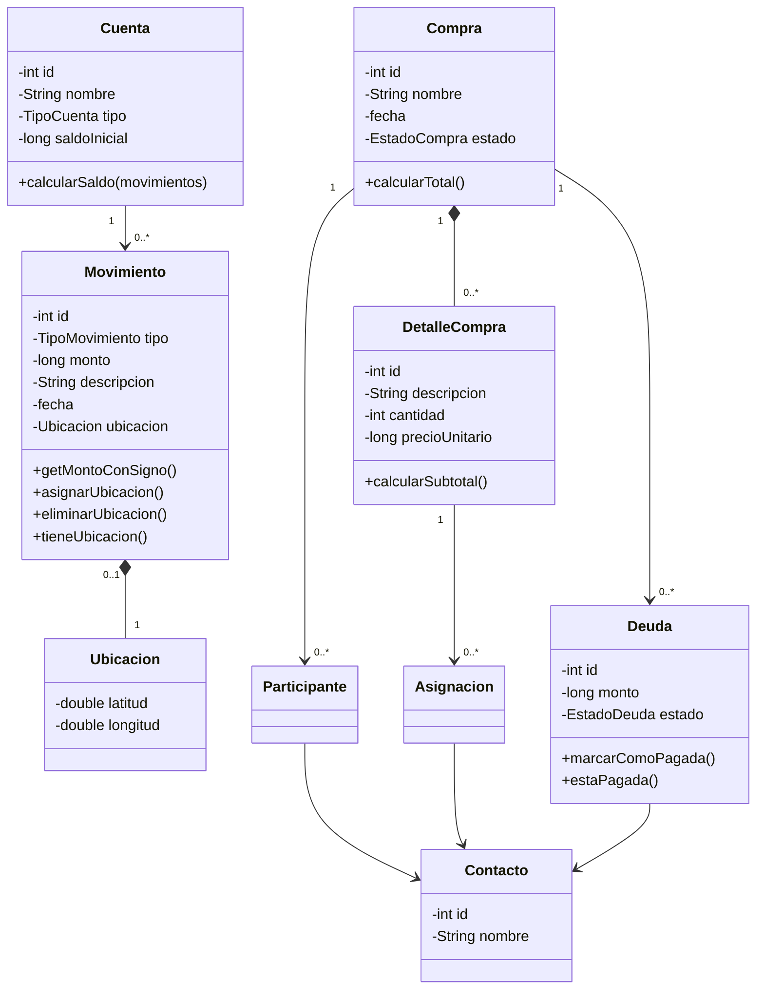

# Diagrama de clases — diseño v1

> Preliminar. Las cardinalidades y métodos deben actualizarse al cerrar S01/S06.

```mermaid
classDiagram
    class Cuenta {
      -int id
      -String nombre
      -TipoCuenta tipo
      -long saldoInicial
      +calcularSaldo(movimientos)
    }

    class Movimiento {
      -int id
      -TipoMovimiento tipo
      -long monto
      -String descripcion
      -fecha
      -Ubicacion ubicacion
      +getMontoConSigno()
      +asignarUbicacion()
      +eliminarUbicacion()
      +tieneUbicacion()
    }

    class Ubicacion {
      -double latitud
      -double longitud
    }

    class Contacto {
      -int id
      -String nombre
    }

    class Compra {
      -int id
      -String nombre
      -fecha
      -EstadoCompra estado
      +calcularTotal()
    }

    class DetalleCompra {
      -int id
      -String descripcion
      -int cantidad
      -long precioUnitario
      +calcularSubtotal()
    }

    class Participante
    class Asignacion

    class Deuda {
      -int id
      -long monto
      -EstadoDeuda estado
      +marcarComoPagada()
      +estaPagada()
    }

    Cuenta "1" --> "0..*" Movimiento
    Movimiento "0..1" *-- "1" Ubicacion
    Compra "1" *-- "0..*" DetalleCompra
    Compra "1" --> "0..*" Participante
    Participante --> Contacto
    DetalleCompra "1" --> "0..*" Asignacion
    Asignacion --> Contacto
    Compra "1" --> "0..*" Deuda
    Deuda --> Contacto
```