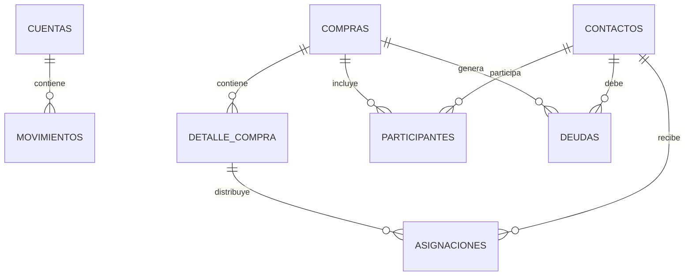

# DER SQLite — preliminar

```mermaid
erDiagram
    CUENTAS ||--o{ MOVIMIENTOS : contiene
    COMPRAS ||--o{ DETALLE_COMPRA : contiene
    COMPRAS ||--o{ PARTICIPANTES : incluye
    CONTACTOS ||--o{ PARTICIPANTES : participa
    DETALLE_COMPRA ||--o{ ASIGNACIONES : distribuye
    CONTACTOS ||--o{ ASIGNACIONES : recibe
    COMPRAS ||--o{ DEUDAS : genera
    CONTACTOS ||--o{ DEUDAS : debe
```

Las columnas y constraints se congelan en S01. Ver `../design/DATABASE.md`.